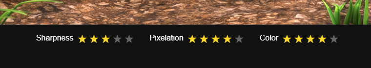

# Video Encoding Comparison Tool

This project provides a Bash + HTML-based visual framework to **compare the quality of multiple video encodings**. It lets you extract reference frames from `.mp4` files, display them in carousels, and rate them manually by sharpness, pixelation, and color fidelity. Summary scores are then computed automatically.

---

## 📦 Features

- Extract 10 consistent random or fixed frames from each video
- Generate a standalone HTML comparison interface
- Rate each frame interactively (ratings are saved to localStorage)
- View average scores per video and per criterion
- See codec, resolution, frame rate, pixel format, bitrate and file size for each encoding
- Play with the [Live demo](https://germain-italic.github.io/video-encoding-comparison/bigbuckbunny/frames/compare.html)


---

## 🛠️ Requirements

- Linux or WSL2
- Bash
- [ffmpeg](https://ffmpeg.org/download.html)
- [ffprobe](https://ffmpeg.org/download.html)

Ensure `ffmpeg` and `ffprobe` are accessible from your shell. Otherwise, install via your package manager:

```bash
sudo apt install ffmpeg
```

---

## 🚀 Usage

1. Place all `.mp4` files you want to compare into a folder (e.g. `bigbuckbunny/`)
2. Run the script:

```bash
chmod +x extract_reference_frames.sh
./extract_reference_frames.sh
```

3. Follow the prompts:
   - Choose your source folder and output directory
   - Choose whether to extract frames and/or generate HTML
   - Choose extraction mode (fixed or consistent random timestamps)
   - Optionally overwrite existing frames without confirmation

4. Open the generated HTML file (e.g. `bigbuckbunny/frames/compare.html`) in your browser.

---

## 📊 How to interpret results

- Click stars to rate each frame's **Sharpness**, **Pixelation**, and **Color**
- Ratings are saved per image locally in your browser (`localStorage`)
- Average scores are automatically calculated per video
- Each video displays:
  - File size (e.g. `1.5G`)
  - Codec details (e.g. `H264 Main @ 1920x1080 / 30 fps / yuv420p / 19306 kbps`)

---

## 📁 Output structure

```text
bigbuckbunny/
├── video1.mp4
├── video2.mp4
└── frames/
    ├── video1/
    │   ├── frame_01.png
    │   └── ...
    ├── video2/
    │   └── ...
    └── compare.html
```

---

## 📖 Notes

- **Ratings are preserved** as long as `localStorage` is not cleared in the browser.
- You can regenerate the HTML file safely without losing your ratings.
- All file paths are relative and work offline.

---

## 🐰 Demo with Big Buck Bunny video and comparison table of Adobe Media Encoder 2025 presets vs ffmpeg direct export

[Big Buck Bunny](https://peach.blender.org/) is an animation movie commonly used to test video playback since it is royalty-free. For this comparison, I have downloaded the [1080p 30fps version](https://download.blender.org/demo/movies/BBB/) which is 264MB.

Then, using Adobe Media Encoder 2025, I have exported a version with all the available presets.

I ended up with the stats below, and 18 GB of videos to watch for find out which preset works the best for my needs.

| Preset | Size | Encoding duration |
|----------|-------|------------------|
| Original file | 264M | n/a |
| Match Source - Adaptive High Bitrate | 186M | 00:03 |
| Match Source - Adaptive Medium Bitrate | 177M | 00:03 |
| Match Source - Adaptive Low Bitrate | 172M | 00:04 |
| H264 - Match Source - 2020 | 777M | 00:10 |
| H264 - Match Source - HLG | 777M | 00:09 |
| H264 - Match Source - PQ | 771M | 00:10 |
| Adobe Stock HD with Audio (20Mbps) | 1.5G | 00:10 |
| Adobe Stock UHD with Audio (40Mbps) | 3.0G | 00:35 |
| Facebook 720p HD | 881M | 00:06 |
| Facebook 1080p Full HD | 962M | 00:03 |
| High Quality 720p HD | 771M | 00:06 |
| High Quality 1080p HD | 1.5G | 00:03 |
| Mobile Device 1080p HD | 651M | 00:03 |
| Twitter 720p HD | 180M | 00:06 |
| Twitter 1080p Full HD | 767M | 00:03 |
| Vimeo 720p HD | 641M | 00:06 |
| Vimeo 1080p Full HD | 1.3G | 00:03 |
| YouTube 720p HD | 1.1G | 00:06 |
| YouTube 1080p Full HD | 1.2G | 00:03 |

I created a script to extract a few frames in all versions of the video, present them in a synchronized carousel, with a simple notation system.

## Go to the demo page now: [https://germain-italic.github.io/video-encoding-comparison/bigbuckbunny/frames/compare.html](https://germain-italic.github.io/video-encoding-comparison/bigbuckbunny/frames/compare.html)

Use the stars to rate each frame of each preset:



Read the Rating Summary at the bottom of the page.

_NB: the rating will work even if you don't rate all images._


### Personal ratings and analysis:

| Preset | Filesize | Duration | Sharpness | Pixelation | Color | Average | Quality/Size Ratio (%) |
|--------|----------|----------|-----------|------------|-------|---------|-------------------------|
| Original file | 264M | n/a | 5 | 5 | 5 | 5 | **100%** |
| H264 - Match Source - 2020 | 777M | 00:10 | 4.71 | 4.43 | 5.00 | 4.71 | **32%** |
| Vimeo 1080p Full HD | 1.3G | 00:03 | 4.57 | 4.43 | 5.00 | 4.67 | **19%** |
| Adobe Stock UHD with Audio (40Mbps) | 3.0G | 00:35 | 4.43 | 4.71 | 4.86 | 4.67 | **10%** |
| Facebook 1080p Full HD | 962M | 00:03 | 4.57 | 4.29 | 5.00 | 4.60 | **26%** |
| YouTube 1080p Full HD | 1.2G | 00:03 | 4.29 | 4.29 | 5.00 | 4.52 | **19%** |
| Adobe Stock HD with Audio (20Mbps) | 1.5G | 00:10 | 4.29 | 4.14 | 5.00 | 4.48 | **16%** |
| High Quality 1080p HD | 1.5G | 00:03 | 4.43 | 4.14 | 4.86 | 4.48 | **16%** |
| Mobile Device 1080p HD | 651M | 00:03 | 4.43 | 4.00 | 5.00 | 4.48 | **37%** |
| High Quality 720p HD | 771M | 00:06 | 3.86 | 3.86 | 4.86 | 4.19 | **29%** |
| YouTube 720p HD | 1.1G | 00:06 | 4.14 | 3.86 | 4.38 | 4.14 | **20%** |
| Vimeo 720p HD | 641M | 00:06 | 4.00 | 3.43 | 4.86 | 4.10 | **34%** |
| Match Source - Adaptive Medium Bitrate | 177M | 00:03 | 4.14 | 3.14 | 4.86 | 4.05 | **77%** |
| Facebook 720p HD | 881M | 00:06 | 3.71 | 3.57 | 4.83 | 4.00 | **24%** |
| Match Source - Adaptive High Bitrate | 186M | 00:03 | 3.57 | 3.14 | 4.71 | 3.81 | **69%** |
| Match Source - Adaptive Low Bitrate | 172M | 00:04 | 3.57 | 3.00 | 4.71 | 3.76 | **74%** |
| Twitter 1080p Full HD | 767M | 00:03 | 3.14 | 2.43 | 4.29 | 3.29 | **23%** |
| H264 - Match Source - HLG | 777M | 00:09 | 3.29 | 4.14 | 1.50 | 3.05 | **21%** |
| H264 - Match Source - PQ | 771M | 00:10 | 2.86 | 3.57 | 1.00 | 2.48 | **17%** |
| Twitter 720p HD | 180M | 00:06 | 1.43 | 1.14 | 4.00 | 2.19 | **65%** |

## Mathematical formula

**Quality/Size Ratio = (Quality_preset / Quality_original) × (Size_original / Size_preset) × 100**

Where:
- Quality_preset = Average quality score of the preset
- Quality_original = 5 (reference quality)
- Size_original = 264M (reference file size)
- Size_preset = File size of the preset

This formula ensures that:
- Higher quality increases the ratio
- Smaller file size increases the ratio
- The original file has a ratio of exactly 100%
- No preset can exceed 100% since quality cannot exceed the original (5/5)

## Analysis results

**Best quality/size ratios:**
- **Match Source - Adaptive Medium Bitrate**: 77% (quality 4.05, 177M)
- **Match Source - Adaptive Low Bitrate**: 74% (quality 3.76, 172M)  
- **Match Source - Adaptive High Bitrate**: 69% (quality 3.81, 186M)

**Notable ratios:**
- **Twitter 720p HD**: 65% (quality 2.19, 180M) - very lightweight compensates for low quality
- **Mobile Device 1080p HD**: 37% (quality 4.48, 651M) - good quality but heavier
- **Vimeo 720p HD**: 34% (quality 4.10, 641M) - decent balance

**Least efficient:**
- **Adobe Stock UHD with Audio (40Mbps)**: 10% - highest quality but extremely heavy
- **High Quality 1080p HD** and **Adobe Stock HD**: 16% - good quality but very heavy

The "Match Source - Adaptive" presets offer the best efficiency by maintaining reasonable quality while significantly reducing file size.


## Thoughts on the AME presets and steps forward with `ffmpeg` direct export

I realized that all presets exporting files with sufficient quality  ("Average" column > 4.5)  generate files 3 to 5 times heavier than the original!

As an alternative to AME, here's a test to export with ffmpeg directly:

```
ffmpeg -i bbb_sunflower_1080p_30fps_normal.mp4 \
  -c:v libx264 -preset slower -crf 23 \
  -tune animation \
  -c:a aac -b:a 160k \
  -map_metadata -1 -movflags +faststart \
  bbb_sunflower_1080p_30fps_normal_crf23_optimized.mp4
```

This is producing a 230MB video. The encoding process takes 23 minutes.  
**The quality is very close to the original video according to my visual ratings of still frames in the comparison tool, and the filesize is actually a bit lower.**

Another test with crf 21 ends up with 283MB barely any noticeable difference on the test video.

### Here is the breakdown:

| Parameter                    | Description                                                                 | Reason for Use                                                                 |
|-----------------------------|-----------------------------------------------------------------------------|--------------------------------------------------------------------------------|
| `-i filename.mp4` | Specifies the input video file                                             | Source video to be re-encoded                                                  |
| `-c:v libx264`              | Uses the x264 encoder for video                                            | High-quality, widely supported H.264 encoding                                 |
| `-preset slower`            | Sets the encoding speed/efficiency tradeoff                                | Slower preset improves compression efficiency, reducing file size             |
| `-crf 21`                   | Sets Constant Rate Factor for video quality (lower = better)               | CRF 21 is close to original while significantly reducing file size   |
| `-tune film` (optional)     | Adapts settings to specific content types                                   | e.g. `film`, `animation`, `grain`, `stillimage`, `fastdecode`, `zerolatency` |
| `-c:a aac`                  | Sets audio codec to AAC                                                    | Good compression and compatibility for audio                                  |
| `-b:a 160k`                 | Sets audio bitrate                                                         | Lower than original to reduce size while maintaining acceptable quality       |
| `-map_metadata -1`          | Removes all metadata from output                                           | Avoids unnecessary extra bytes, ensures clean output                          |
| `-movflags +faststart`      | Optimizes file for web streaming by moving metadata to the beginning       | Enables playback before full download                                         |
| `filename_crf21_optimized.mp4` | Output file                                           | Final optimized video                                                          |

### Tunable variables

| Variable     | Purpose                              | Typical Values         | Effect                                                                         |
|--------------|--------------------------------------|-------------------------|--------------------------------------------------------------------------------|
| `-crf`       | Controls video quality and size      | 18–28                   | Lower = better quality, larger size. 23 is default, 18 is near-lossless        |
| `-preset`    | Compression efficiency vs speed      | ultrafast → placebo     | Slower = better compression, smaller file. Affects encoding time               |
| `-b:a`       | Sets audio quality and size          | 96k–320k                | Lower = smaller file, reduced audio fidelity                                   |
| `-tune`      | Adjusts encoding to content type     | film, animation, grain, stillimage, fastdecode, zerolatency | Fine-tunes encoder settings for specific use cases (optional)         |

#### Presets

As mentioned in [the documentation](https://trac.ffmpeg.org/wiki/Encode/H.264#a2.Chooseapresetandtune) the values for preset are:

- `ultrafast`
- `superfast`
- `veryfast`
- `faster`
- `fast`
- `medium` – default preset
- `slow`
- `slower`
- `veryslow`
- `placebo`

Also worth mentioning:

> You can optionally use `-tune` to change settings based upon the specifics of your input. Current tunings include:

- `film` – use for high quality movie content; lowers deblocking
- `animation` – good for cartoons; uses higher deblocking and more reference frames
- `grain` – preserves the grain structure in old, grainy film material
- `stillimage` – good for slideshow-like content
- `fastdecode` – allows faster decoding by disabling certain filters
- `zerolatency` – good for fast encoding and low-latency streaming


> To list all possible internal presets and tunes:

```
ffmpeg -hide_banner -f lavfi -i nullsrc -c:v libx264 -preset help -f mp4 -
```


---

## 🪪 License

MIT License

> © 2025 Germain-Italic. Free for personal and commercial use with attribution.

> Big Buck Bunny © 2008, [Blender Foundation](www.bigbuckbunny.org) under the Creative Commons Attribution 3.0 license.

> This project is not affiliated with any brands mentionned on this page.